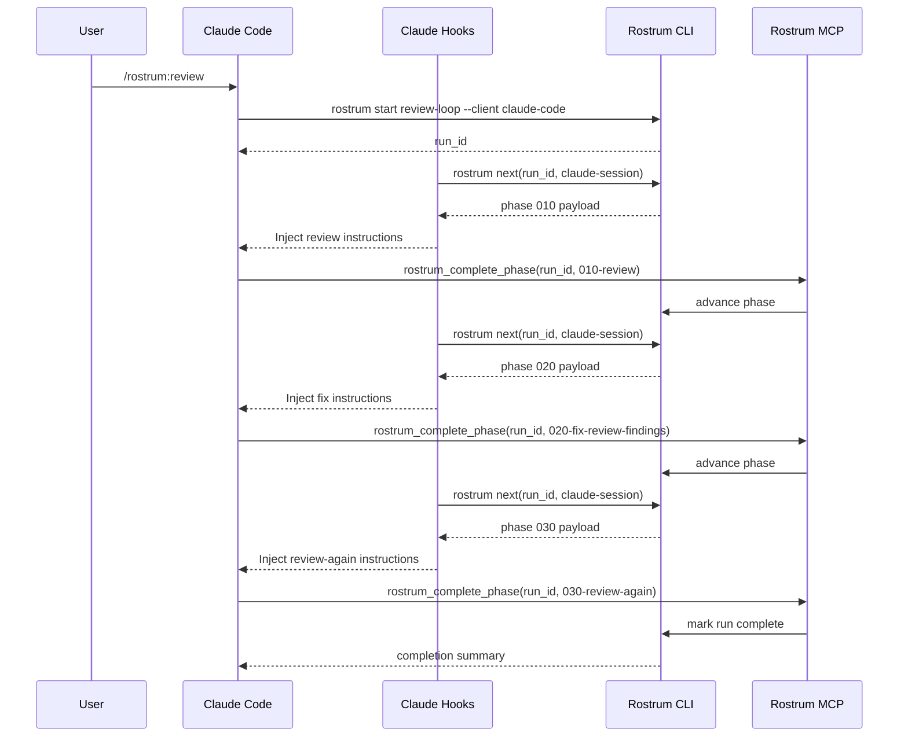

# Claude Code Adapter Design

## Classification

- Support tier: `managed`
- Why: Claude Code provides the strongest fit for lifecycle-aware orchestration through hooks, commands, skills, agents, and MCP.

## Integration goal

Claude Code should feel like the reference Rostrum experience:

- the user stays inside the active Claude Code session
- Rostrum owns run state externally
- hooks and MCP carry phase boundaries reliably

## Adapter components

1. `rostrum-control` MCP server
   - exposes `rostrum_start_flow`, `rostrum_next`, `rostrum_complete_phase`, `rostrum_abort_flow`, `rostrum_status`
2. Claude Code command package
   - installs `/rostrum:review`
3. Claude Code hook bundle
   - binds to session start, prompt submit, stop, and subagent stop
4. Local adapter bridge
   - maps Claude session IDs to Rostrum run IDs

## Start trigger

The preferred start trigger is `/rostrum:review`.

Flow:

1. User enters `/rostrum:review`.
2. Claude command calls `rostrum start review-loop --client claude-code`.
3. Rostrum creates a run and binds the active Claude session.
4. The command requests the first phase payload from `rostrum next`.
5. Claude receives the rendered phase prompt and completion contract.

## State storage

Canonical state remains in Rostrum:

- `run.json`
- `next.json`
- phase receipts

Claude-specific overlay fields:

- `claude_session_id`
- `hook_registration_version`
- `last_prompt_submit_at`
- `last_payload_hash`
- `completion_transport = "mcp_tool"`
- `stop_capability = true`

Example overlay path:

```text
~/.local/state/rostrum/runs/<run-id>/sessions/claude-code/<session-id>.json
```

## Injection strategy

Primary injection mode: `hook_payload`.

Implementation:

1. Hook reads active run binding for the Claude session.
2. Hook calls `rostrum next --client claude-code --session <id>`.
3. Rostrum returns the currently active phase payload.
4. Hook injects the payload into the live session as structured context rather than depending on the user to paste it.

Claude-specific prompt framing should include:

- phase title
- phase objective
- allowed completion tool
- what to do before calling completion

## Completion strategy

Primary completion mode: explicit MCP tool call.

Expected tool:

- `rostrum_complete_phase`

Completion payload:

- `run_id`
- `phase_id`
- optional summary
- optional artifact references

Rostrum validates the phase, advances state, and returns whether another phase is ready. The Claude hook can then inject the next phase immediately.

## Stop and abort

Claude hooks make stop handling credible:

- if the user stops mid-phase, the hook records a paused session event
- if `rostrum abort` is invoked elsewhere, the next Claude lifecycle event sees the aborted state and surfaces a stop message

## Review workflow: install to end-to-end run

### Operator steps

```bash
rostrum install rostrum/review-loop
rostrum setup plan rostrum/review-loop
rostrum setup apply rostrum/review-loop
rostrum init rostrum/review-loop --client claude-code
```

### Runtime steps

1. User opens Claude Code in the target repo.
2. User runs `/rostrum:review`.
3. Claude adapter starts the run and injects phase `010-review`.
4. Agent reviews code and calls `rostrum_complete_phase`.
5. Rostrum advances to `020-fix-review-findings`.
6. Hook injects fix instructions and any artifacts from phase 1.
7. Agent fixes findings and calls `rostrum_complete_phase`.
8. Rostrum advances to `030-review-again`.
9. Hook injects final review instructions.
10. Agent completes the final review and calls `rostrum_complete_phase`.
11. Rostrum marks the run complete and the hook shows the completion summary.

## Workflow visualization



## Implementation notes

- Claude Code is the first adapter to build.
- It should define the reference MCP tool contract used by every other client.
- It also defines the reference `managed` support tier semantics for docs and marketplace labeling.
