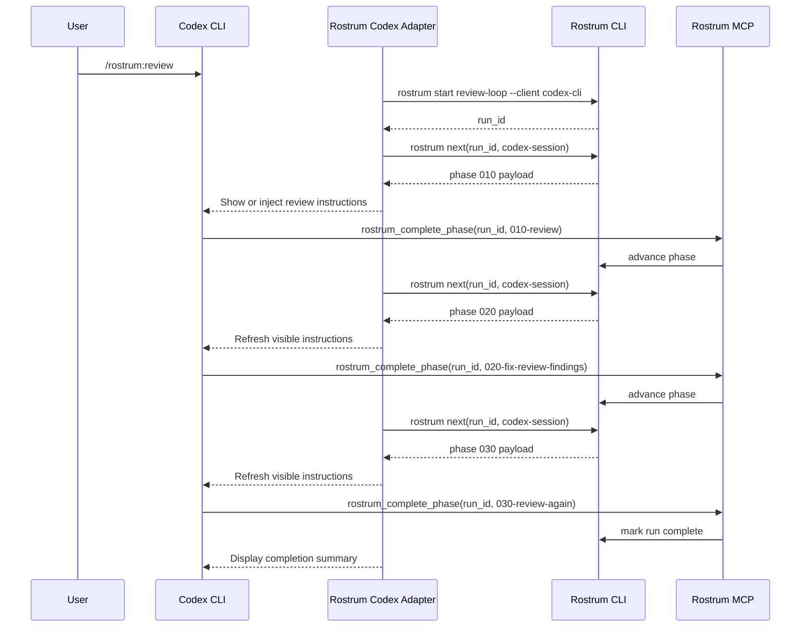

# Codex CLI Adapter Design

## Classification

- Support tier: `cooperative`
- Why: Codex CLI is still worth launch support, but the public control model appears weaker for live session orchestration than Claude Code, OpenCode, or Gemini CLI.

## Integration goal

Codex CLI support should be honest about its limits:

- Rostrum still owns workflow state
- phase completion should still be explicit via MCP
- phase delivery may depend more on visible prompts and operator cooperation

This is not a non-support case. It is a lower-guarantee adapter.

## Adapter components

1. `rostrum-control` MCP server
2. Codex workspace command alias or prompt starter
   - provides `/rostrum:review` or equivalent launch affordance
3. Session tracker
   - records process and working directory identity
4. Prompt refresh helper
   - fetches current phase payload from `rostrum next`

## Start trigger

Preferred start trigger: a user-visible command like `/rostrum:review`.

Playbook start:

1. User triggers the review starter.
2. Adapter calls `rostrum start review-loop --client codex-cli`.
3. Rostrum creates the run and returns the first phase payload.
4. The adapter shows or injects the phase instructions into the active Codex session as far as the client allows.

## State storage

Canonical state remains in Rostrum.

Codex overlay fields:

- `process_id`
- `cwd`
- `session_label`
- `last_payload_hash`
- `delivery_mode`
- `operator_ack_required`
- `completion_transport = "mcp_tool"`

This overlay must explicitly track weaker guarantees:

- whether the next phase was only displayed instead of structurally injected
- whether the operator acknowledged phase refresh

## Injection strategy

Primary injection mode: `instruction_refresh`.

This means:

- Rostrum renders the next phase payload for Codex CLI
- the adapter attempts to surface it in-session
- if the client cannot guarantee delivery, the adapter also presents a visible operator instruction to continue with the new phase

The cooperative contract should be visible in marketplace listings and docs.

## Completion strategy

Primary completion mode: explicit MCP tool call.

Even in cooperative mode, phase advancement stays deterministic because Rostrum does not trust plain text alone.

If the agent does not call the completion tool:

- the run does not advance
- `rostrum status` remains accurate
- the operator can manually resume or reissue the current phase payload

## Stop and continue

Codex CLI may not offer a strong lifecycle stop surface. The adapter should therefore:

- mark the run paused on session loss
- show the current phase again on resume
- require visible acknowledgement when the next phase is only operator-delivered

## Review workflow: install to end-to-end run

### Operator steps

```bash
rostrum install rostrum/review-loop
rostrum setup plan rostrum/review-loop
rostrum setup apply rostrum/review-loop
rostrum init rostrum/review-loop --client codex-cli
```

### Runtime steps

1. User opens the repo in Codex CLI.
2. User triggers `/rostrum:review`.
3. Rostrum starts a run and returns phase `010-review`.
4. Adapter surfaces the review instructions in the active session.
5. Agent performs the review and explicitly calls `rostrum_complete_phase`.
6. Rostrum advances to `020-fix-review-findings`.
7. Adapter refreshes the visible instructions for the fix phase.
8. Agent completes the fix work and calls `rostrum_complete_phase`.
9. Rostrum advances to `030-review-again`.
10. Adapter refreshes the visible instructions again.
11. Agent completes the final review and calls `rostrum_complete_phase`.
12. Rostrum marks the run complete and surfaces final status.

## Workflow visualization



## Implementation notes

- Launch with clear labeling that Codex CLI is `cooperative`, not `managed`.
- The adapter should bias toward explicit operator visibility over pretending to have enforcement that it does not actually have.
- If stronger lifecycle controls appear later, the support tier can be upgraded without changing the core playbook model.
