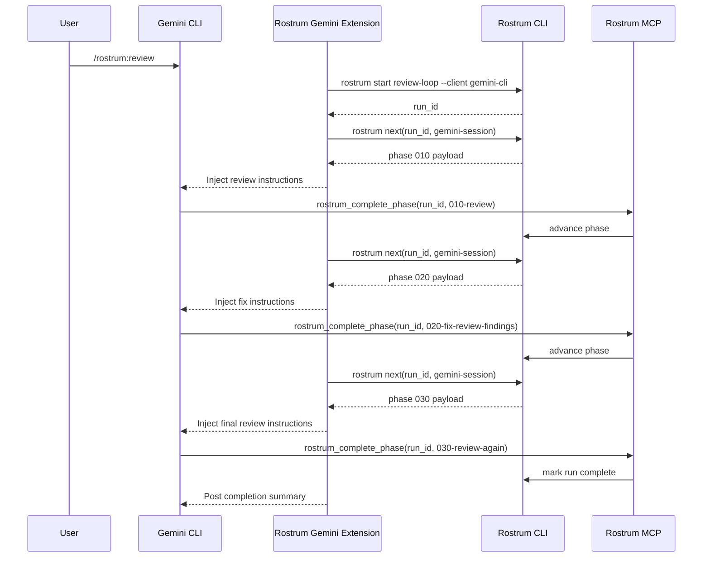

# Gemini CLI Adapter Design

## Classification

- Support tier: `managed`
- Why: Gemini CLI has a credible extension, hook, and MCP surface, which should let Rostrum enforce phase transitions strongly enough for launch.

## Integration goal

Gemini CLI should deliver a first-class workflow experience close to Claude Code, but with more client-specific extension packaging.

## Adapter components

1. `rostrum-control` MCP server
2. Gemini CLI extension package
   - registers the review command
   - installs hooks
   - ships prompt framing helpers
3. Hook handlers
   - before or after tool
   - before or after agent
   - session boundary hooks
4. Session binder
   - links Gemini session identity to Rostrum runs

## Start trigger

Preferred start trigger: extension command or slash command equivalent for `/rostrum:review`.

Flow:

1. User invokes the Rostrum review command.
2. Extension starts a run through `rostrum start`.
3. Extension fetches the first phase via `rostrum next`.
4. Extension injects the phase into the active Gemini session.

## State storage

Canonical state remains in Rostrum.

Gemini overlay fields:

- `gemini_session_id`
- `extension_version`
- `last_hook_event`
- `last_payload_hash`
- `completion_transport = "mcp_tool"`
- `stop_capability = true`

## Injection strategy

Primary injection mode: extension-driven hook injection.

The adapter should use Gemini lifecycle hooks to ensure that:

- the active phase instructions are present before the agent begins work
- the next phase is not injected until Rostrum confirms advancement
- phase framing remains structured and consistent

## Completion strategy

Primary completion mode: MCP tool call.

The Gemini extension should treat plain-text markers as informational only. The run only advances when Rostrum receives `rostrum_complete_phase`.

## Stop and continue

Because Gemini exposes session-boundary and tool-boundary hooks, the adapter can:

- halt further progression after abort
- surface a resume message if a session restarts mid-run
- re-fetch the current phase if local extension state is stale

## Review workflow: install to end-to-end run

### Operator steps

```bash
rostrum install rostrum/review-loop
rostrum setup plan rostrum/review-loop
rostrum setup apply rostrum/review-loop
rostrum init rostrum/review-loop --client gemini-cli
```

### Runtime steps

1. User opens the repo in Gemini CLI.
2. User triggers the Rostrum review command.
3. The Gemini extension starts the Rostrum run and binds the current session.
4. The extension fetches and injects phase `010-review`.
5. Agent completes the review and calls the MCP completion tool.
6. Rostrum advances and exposes phase `020-fix-review-findings`.
7. Hook handler injects the fix phase.
8. Agent completes the fix phase and calls the MCP completion tool.
9. Rostrum advances to `030-review-again`.
10. Hook handler injects the final review payload.
11. Final completion closes the run and the extension posts a completion message.

## Workflow visualization



## Implementation notes

- Gemini CLI should be in the first launch wave with Claude Code and OpenCode.
- The extension package will likely be heavier than Claude's adapter, so adapter packaging should be part of `rostrum init`.
- This adapter defines launch semantics for the `managed` tier alongside Claude Code.
