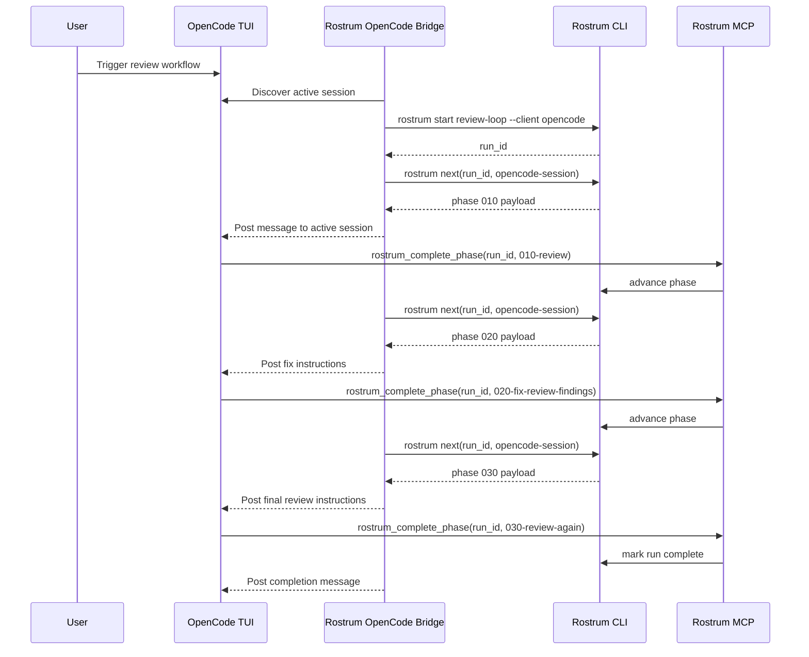

# OpenCode Adapter Design

## Classification

- Support tier: `controller-driven`
- Why: OpenCode exposes a clean server-side control plane behind the interactive client, which is ideal for a sidecar-style Rostrum adapter.

## Integration goal

OpenCode should be the cleanest "Rostrum beside the session" implementation:

- the user remains in the TUI
- Rostrum drives state through OpenCode's documented session and message interfaces
- the adapter behaves more like a controller than a hook bundle

## Adapter components

1. `rostrum opencode bridge`
   - sidecar process that talks to the OpenCode server
2. `rostrum-control` MCP server
   - consistent completion tools across clients
3. Session binding layer
   - maps OpenCode session IDs to Rostrum run IDs
4. Command registration
   - installs a start action for `/rostrum:review` or equivalent command surface

## Start trigger

Preferred trigger: adapter command that starts the run against the current OpenCode session.

Flow:

1. User triggers the review command.
2. Bridge discovers the active OpenCode session.
3. Bridge calls `rostrum start review-loop --client opencode`.
4. Rostrum returns a run ID and first phase.
5. Bridge posts the first phase payload into the active session through the OpenCode session API.

## State storage

Canonical state remains in Rostrum.

OpenCode overlay fields:

- `opencode_session_id`
- `opencode_workspace_id`
- `last_message_id`
- `event_cursor`
- `injection_mode = "session_api_message"`
- `stop_capability = "server_side_control"`

This is more robust than prompt-only clients because the bridge can correlate exact message IDs with Rostrum phase dispatches.

## Injection strategy

Primary injection mode: server message insertion into the active session.

Implementation:

1. Bridge subscribes to OpenCode session events.
2. When a phase becomes active, bridge calls `rostrum next`.
3. Rostrum returns a rendered payload for `opencode`.
4. Bridge inserts that payload as a structured message in the existing session.

Because the bridge owns event correlation, it can mark delivery as:

- `queued`
- `posted`
- `acknowledged`

## Completion strategy

Primary completion mode: explicit MCP tool call.

OpenCode agent flow:

1. Agent works inside the current session.
2. Agent calls `rostrum_complete_phase`.
3. Rostrum advances run state.
4. Bridge receives the update and posts the next phase payload.

## Enforcement model

OpenCode is not hook-first, but it has stronger control than a cooperative client because the bridge can:

- inject into the current session without leaving the TUI
- track session events
- decide whether the next phase should be posted yet
- stop posting further instructions if the run is aborted

## Review workflow: install to end-to-end run

### Operator steps

```bash
rostrum install rostrum/review-loop
rostrum setup plan rostrum/review-loop
rostrum setup apply rostrum/review-loop
rostrum init rostrum/review-loop --client opencode
```

### Runtime steps

1. User opens the repo in OpenCode.
2. User triggers the Rostrum review command.
3. OpenCode bridge binds the active OpenCode session to a new Rostrum run.
4. Bridge posts phase `010-review` into the session.
5. Agent reviews code and completes the phase through the Rostrum MCP tool.
6. Rostrum advances to `020-fix-review-findings`.
7. Bridge posts the next phase into the same session.
8. Agent fixes findings and completes the phase.
9. Rostrum advances to `030-review-again`.
10. Bridge posts the final review payload.
11. Final completion marks the run complete and the bridge posts a final status message.

## Workflow visualization



## Implementation notes

- Build this adapter immediately after Claude Code.
- The bridge should be a long-running local process or short-lived on-demand worker, depending on how stable the OpenCode event API is.
- This adapter defines the reference semantics for the `controller-driven` tier.
