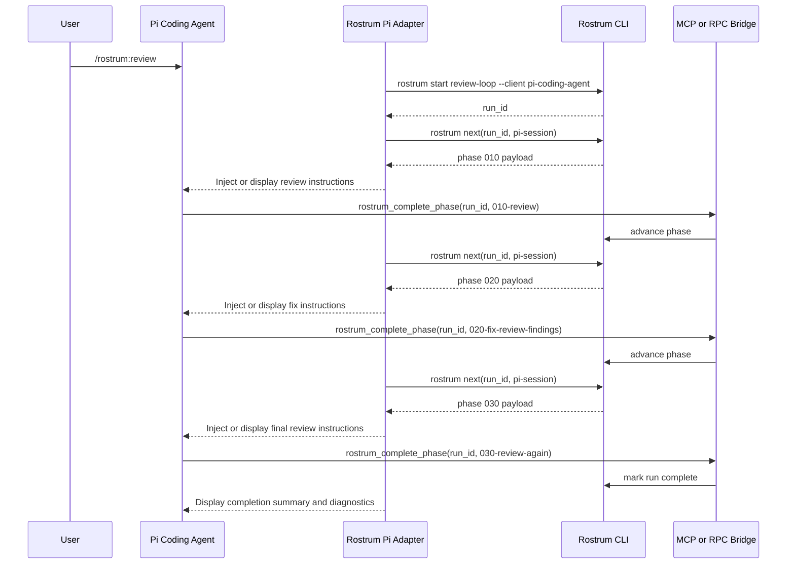

# Pi Coding Agent Adapter Design

## Classification

- Support tier: `experimental`
- Why: Pi Coding Agent appears extensible enough to be interesting, but it will require more custom implementation and validation than the launch-critical clients.

## Integration goal

Pi support should exist to validate the adapter model and to keep the path open for OpenClaw-adjacent integrations, but it should not be positioned as equally production-ready at launch.

## Adapter components

1. `rostrum-control` MCP or RPC bridge
2. Pi extension package
3. Event handlers for session and task lifecycle
4. Optional RPC transport for stronger run-state synchronization

## Start trigger

Preferred trigger: installed extension command for `/rostrum:review`.

Playbook start:

1. User starts the review playbook from the Pi command surface.
2. Extension or RPC bridge calls `rostrum start review-loop --client pi-coding-agent`.
3. Rostrum returns a run ID and first phase payload.
4. Extension injects the phase into the active Pi session.

## State storage

Canonical state remains in Rostrum.

Pi overlay fields:

- `pi_session_id`
- `extension_version`
- `event_stream_cursor`
- `rpc_mode_enabled`
- `last_payload_hash`
- `completion_transport`

Because the adapter is experimental, the overlay should also capture diagnostics:

- `adapter_warning_count`
- `delivery_failures`
- `fallback_mode`

## Injection strategy

Primary injection mode: extension event or RPC-driven message insertion.

Fallback mode:

- visible operator prompt refresh if the extension cannot safely inject the next phase

## Completion strategy

Primary completion mode: explicit MCP or RPC tool call.

Fallback:

- operator-triggered `rostrum complete-phase` if the experimental adapter fails to relay tool events

That fallback should be documented as exceptional and visible to the operator.

## Stop and continue

If Pi exposes stable event handlers, the adapter can pause and resume credibly. If not, the adapter should degrade gracefully:

- mark the run paused
- surface the current phase on reconnect
- never auto-advance without a durable completion receipt

## Review workflow: install to end-to-end run

### Operator steps

```bash
rostrum install rostrum/review-loop
rostrum setup plan rostrum/review-loop
rostrum setup apply rostrum/review-loop
rostrum init rostrum/review-loop --client pi-coding-agent
```

### Runtime steps

1. User opens the repo in Pi Coding Agent.
2. User triggers the Rostrum review command.
3. Pi adapter starts the run and binds the current Pi session.
4. Adapter injects or displays phase `010-review`.
5. Agent completes the review and calls the Rostrum completion tool.
6. Rostrum advances to `020-fix-review-findings`.
7. Adapter injects or displays the fix phase.
8. Agent completes the fix phase and calls the completion tool.
9. Rostrum advances to `030-review-again`.
10. Adapter injects or displays the final review phase.
11. Final completion marks the run complete.
12. Adapter records diagnostics for any degraded behaviors observed during the run.

## Workflow visualization



## Implementation notes

- Keep this adapter behind an experimental flag at first release.
- Use it to validate how much of the universal playbook model can survive in less mature client surfaces.
- If Pi stabilizes, it can graduate to `cooperative` or better without changing the core Rostrum contracts.
